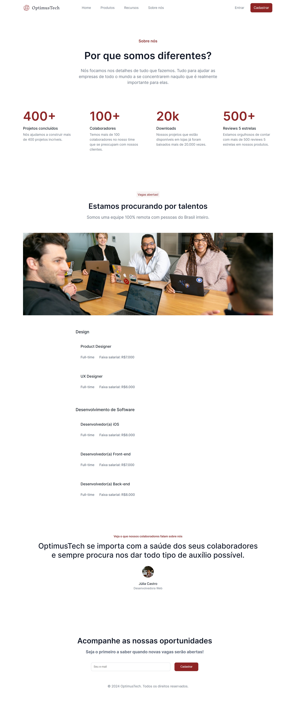

<h1 align="center">Projeto - 7DaysOfCode - OptimusTech</h1>

 Desenvolvido no Desafio 7 Days Of Code de HTML e CSS da plataforma de estudos Alura. Durante 7 dias pratiquei o meu conhecimento de HTML e CSS para desenvolver uma página através de um layout no Figma. Utilizei conceitos como Flexbox, media queries, unidades relativas e medidas responsivas em CSS. 

 
 

  

    <h3>Página completa</h3> 
    

 

## 🚀 Tecnologias
* HTML e CSS
* Media queries
* Flexbox
 

## 💻 Projeto
Para visualizar a última vesão do projeto clique abaixo:
 
 
Visite o [projeto](https://7daysofcode-optimustech.vercel.app/) online.
 
 

## 🧠 Desafio
Todos os dias os desafios foram enviados, sendo eles:

- [x] DIA 1
> Já no primeiro dia, você vai ser apresentado com o layout de uma página no Figma, analisá-lo e usá-lo para criar o cabeçalho da sua página, que contém um logo, links para outras páginas e alguns botões.

- [x] DIA 2
> Aqui você desenvolverá a segunda seção da página, que é um 'Sobre nós', algo muito básico e presente na maioria das páginas empresariais. Nessa seção, você terá diferentes partes de texto, cada uma com um tamanho, cor e alinhamento diferente.

- [x] DIA 3
> Nesse dia você vai precisar trabalhar bastante com alinhamento no CSS, e conhecimentos de Flexbox ou Grid vão facilitar muito a sua vida! A seção se chama 'Métricas e resultados' e contém 4 blocos de texto lado a lado, cada um com diferentes blocos internos.

- [x] DIA 4
> Chegou a hora de brincar com imagens, o pesadelo de muitas pessoas! Nessa seção, você terá algumas partes de texto e uma imagem ilustrativa que terá que ser alinhada corretamente. O uso de medidas responsivas é algo que poderá te ajudar bastante.

- [x] DIA 5
> Esse será provavelmente o dia mais desafiador, pois você desenvolverá a seção de 'Vagas' da página, que contém diferentes grupos de blocos agrupados e diversas informações sobre as vagas abertas.

- [x] DIA 6
> Chegando quase no final, você desenvolverá a seção de 'Depoimentos', que envolverá conhecimentos de mudança de cor de background, tamanho de fontes e alinhamento de texto e de imagens.

- [x] DIA 7
> No sétimo e último dia do desafio, você criará a parte mais inferior da página: o rodapé. Mas não é um rodapé qualquer, ele contém, entre outras coisas, um formulário para cadastro de e-mail com um valor pré-definido e também um botão, ambos perfeitamente alinhados. Você irá fechar com chave de ouro!

### Conclusão:
Foi possível colocar em prática os conceitos que aprendi durante os cursos da Formação da Alura "[A partir do Zero: HTML e CSS para Projetos Web](https://cursos.alura.com.br/degree/certificate/2e85c664-e5e4-450f-9994-074e43c763e0?lang=pt_BR)" e consequentemente fixar ainda mais o aprendizado, além de aprender ainda mais!

 

---

Feito com muito ♥

Obrigado por visitar meu Github ♥
Me dê um "FOLLOW" que retribuo, vamos criar novas conexões 😊

Até a próxima! 👋😊

